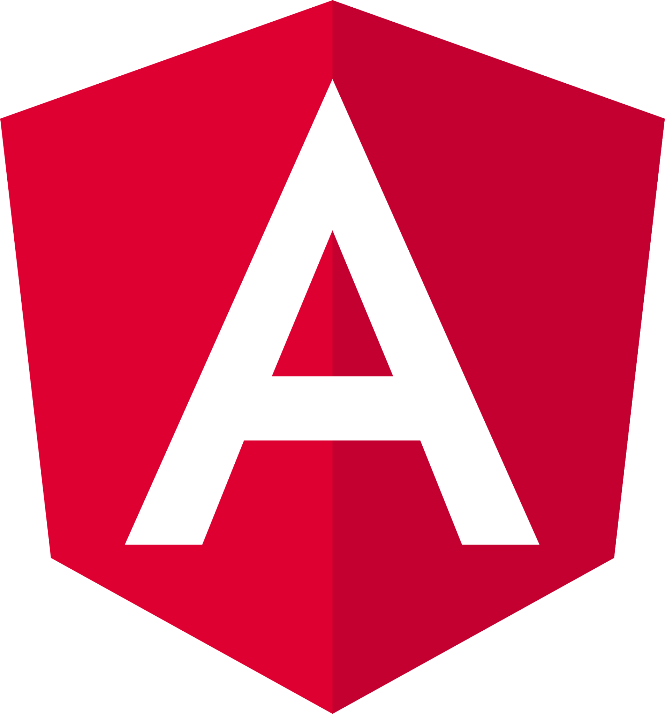

    
    

        
        
        
        <h3>
    hey there
    
    </h3>
    

### About Me:

I am a Full Stack Developer .

- 🔭 I’m working as a Software Engineer and contributing to frontend and backend for building web applications.
- 👨‍💻 You can also check out my portfolio
  at [https://supriya-48.github.io/portfolio/](https://supriya-48.github.io/portfolio/)
- 📫 You can reach me at **muppusupriya@gmail.com**
----

### Languages and DB:

 
   
   
   
   
  
 
  

### Web Technologies and Frameworks:

  
   
  
  
  

   

&nbsp;
